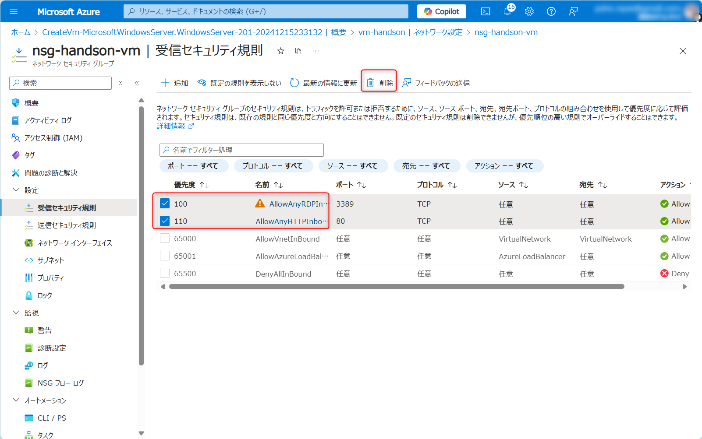

# Exercise4: Bastion利用

## 【目次】

1. [RDP ポートと HTTP ポートを閉じる](#rdpポートとhttpポートを閉じる)
1. [Bastion作成](#bastion作成)
1. [Bastion経由で接続（Azureポータル）](#bastion経由で接続azureポータル)
1. [Bastion経由で接続（ネイティブクライアント）](#bastion経由で接続ネイティブクライアント)

## RDP ポートと HTTP ポートを閉じる

1. Azure ポータル上部の検索窓で「ネットワークセキュリティグループ」を検索、開く

1. 最初に作成したネットワークセキュリティグループを開く

1. [設定]-[受信セキュリティ規則]を開く

1. 「RDP」ポートと「HTTP」ポートの設定を選択して「削除」

    

## Bastion 作成

1. Azure ポータルで最初に作成した仮想マシンの画面を開く

1. 「Bastion」ページから Bastion 作成

## Bastion 経由で接続（Azure ポータル）

1. Azure ポータルで最初に作成した仮想マシンの画面を開く

1. 「概要」ページにある [接続]-[Bastion] を選択

    

1. ユーザー名、パスワードを入力して「接続」

    (*) クリップボードへの接続許可アラートが出てくるので「許可」にする

    

1. 新しくブラウザが立ち上がって接続できればOK

## 補足：Bastion 経由で接続（ネイティブクライアント）

1. Azure ポータルで作成した Bastion の画面を開く

1. 「設定」ページにある [構成]を選択

1. 「レベル」を[Standard] に変更し、 [ネイティブ クライアント サポート]をチェック

(*)ネイティブ クライアント サポートの機能を使用可能にするには、SKU を Standard 以上にアップグレードする必要があります。
    

(*) 本作業の前提として "azコマンド" がローカル端末にインストール済みである必要があります。
まだインストールされていない場合、以下からインストールを行ってください。

* [Windows での Azure CLI のインストール](https://learn.microsoft.com/ja-jp/cli/azure/install-azure-cli-windows?tabs=azure-cli)

1. コマンドプロンプトを立ち上げる

1. ログイン、初期化

        az login
        az account set --subscription "<SUBSCRIPTION_ID>"

1. RDP ログイン

        az network bastion rdp --name "<BASTION_NAME>" --resource-group "<RESOURCE_GROUP_NAME>" --target-resource-id "<VM_RESOURCE_ID>"

    * VM_RESOURCE_ID は 仮想マシンの [設定]-[プロパティ] にある「リソースID」を利用

1. RDP クライアントを使った接続ができていればOK

    

# 次の Exercise へ

* [Exercise5: Azure Files作成/接続](exercise05.md)