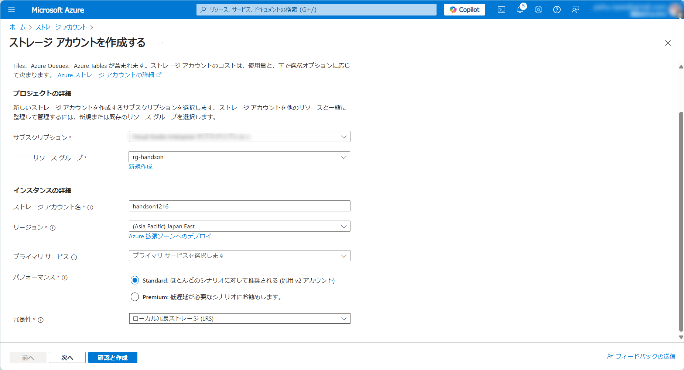
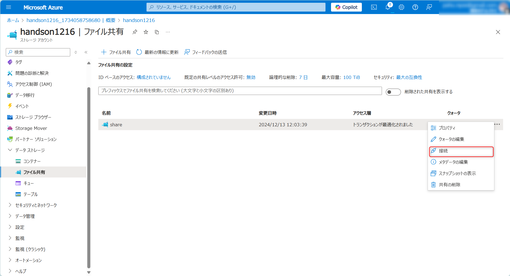

# Exercise5: Azure Files作成/接続

## 【目次】

1. [ストレージアカウント作成](#ストレージアカウント作成)
1. [Filesを作成](#filesを作成)
1. [Filesをマウント](#filesをマウント)
1. [Filesのネットワークを制限](#Filesのネットワークを制限)

## ストレージアカウント作成

1. Azureポータル上部の検索窓で「ストレージ」を検索、「ストレージアカウント」を開く

1. ストレージアカウント一覧画面にある「作成」を選択

1. ストレージアカウントの作成

    1. 「基本」ページ

        * サブスクリプション： （ハンズオン用のサブスクリプション）
        * リソースグループ： （ARMテンプレートで作成したリソースグループ）
        * ストレージアカウント名： （任意。ただしグローバルで重複できないのでランダムな文字列/数字を含めることを推奨）
        * 地域： `Japan East`
        * パフォーマンス： `Standard`
        * 冗長性： `LRS`
        
        

    1. 「詳細設定」ページ ~ 「タグ」ページ

        特に指定なし

    1. 「確認および作成」ページ

        内容を確認して「作成」

## Filesを作成

1. Azureポータルから作成済みの「ストレージアカウント」を開く

1. [データストレージ]-[ファイル共有]を開く

    

1. 「ファイル共有」を選択、「新しいファイル共有」で以下を設定して、「作成」

    * 名前： (任意)
    * レベル： `トランザクションが最適化されました`

    

## Filesをマウント

1. 作成した「ファイル共有」の「・・・（メニュー）」を開き「接続」を選択

    

1. 「Show Script」を押下して表示されるスクリプトをメモしておく

    

1. 作成済みの仮想マシンへRDP接続

1. PowerShell を管理者権限で起動

1. メモしておいたスクリプトを貼り付けて実行

    

1. ドライブとして接続されていることを確認

    

1. ドライブに入って適当なファイルを作成

    

1. Azureポータルに戻って Files の中身を確認

    ファイルが追加されていることを確認

    

## Filesのネットワークを制限
1. Azure Portal にてパブリックネットワークアクセスを制限

    

1. RDP している仮想マシンから、ドライブにアクセスできなくなることを確認

    

1. 仮想マシンが属する指定のサブネットを接続許可

    

    

1. アクセス可能になることを確認

不要なリソースグループは削除して終わりになります。

* [クリーンアップ](exercise99.md)

